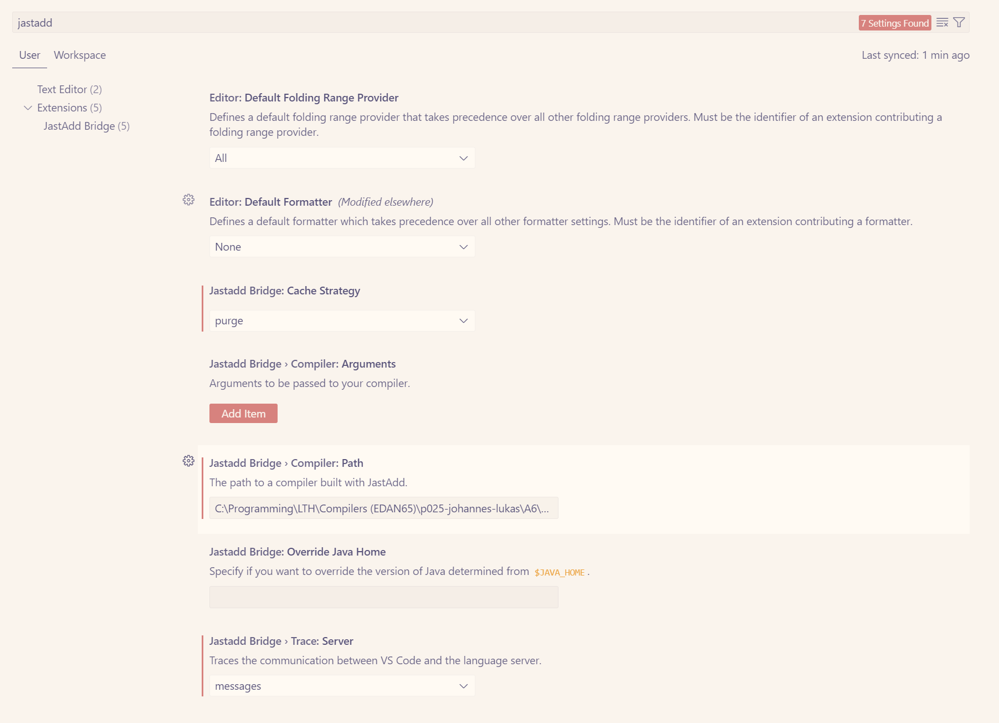
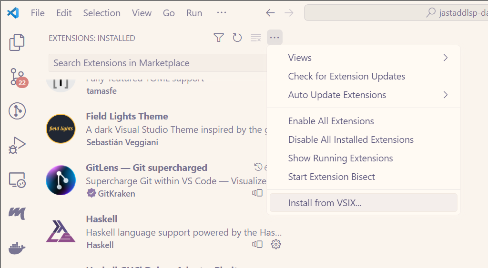

# JastAdd Bridge

A reusable VSCode extention built on the language server protocol, allowing JastAdd tools to interface with LSP interactions.

## Extension usage

The extension launches when it detects a related file. By default it uses the `.jastadd` file associations, but you can add your own. See "file associations" in vscode preferences.

To use JastAdd Bridge with your compiler, you need to provide an absolute path to it in the settings page, which you find by searching for "jastadd". All related settings are grouped here. The compiler you provide should be a standalone jar file, with the executable permission set (if you are on linux).

The first command line argument your compiler takes should be a path to the text file that is to be compiled. Arguments following that are not reserved, and can be set in the settings page (see JastAdd Bridge > Compiler: Arguments).

## Features

`JastAdd Bridge` provides a link between your compiler and the VS Code development environment. By implementing methods with specific names (all prefixed with `lsp_`), you can enable integrated editor features such as hover (text showing up when your mouse is above some specific object) and diagnostic reports (squiggly lines when the compiler reports an error or warning)

### Hover

Synthesizing a metho
n

### Diagnostics

The extension assumes there is some

### Go to definition

- TODO

### "Run" button

- TODO

### Inlay hints

- TODO

### Code completion

- TODO

### Quick fixes

- TODO

## Building

### Prerequisites

- Node.js
- VSCode version 1.75 or higher
- JDK 17 (with $JAVA_HOME set)

### Setup

1. `git clone <git@bitbucket.org>:edan70/jastaddlsp-dag-johannes.git`
2. `cd jastaddlsp-dag-johannes`
3. `npm ci` (clean install)

### Workflow

To run the language server press f5, or run the task "Launch Client" (located in the Run & Debug tab). Doing this will build the server as well. When the build is done a new window will open, with the extension running. Output can be viewed in the "Output" tab, when you select "JastAdd Bridge" in the dropdown.

It is helpful to install the extension, since you can then change its settings in the menu before launching it, and configure a file association. This requires the packaging tool `vsce`, which can be installed with `npm install -g @vscode/vsce`.

**Steps to install:**

1. `vsce package` (generates a .vsix file)
2. Install the generated .vsix file by going to the "extensions" tab, opening the kebab menu in the top right, and selecting "install from VSIX". 

While debugging the extension, it may help to enable "verbose" logging in the extension settings. This shows both the LSP payloads sent between client and server, as well as all traces printed by the server, along with stacktraces if an exception occurs.

## License

This repository is covered by the license BSD 2-clause, see the `LICENCE` file.

## Acknowledgements

- [CodeProber](https://github.com/lu-cs-sde/codeprober/)
- [JastAdd](https://jastadd.cs.lth.se/web/)
- [LSP4J](https://github.com/eclipse-lsp4j/lsp4j)
- [vscode-languageclient](https://www.npmjs.com/package/vscode-languageclient)
- [tinylog](https://tinylog.org/v2/)
- [run-script-os](https://www.npmjs.com/package/run-script-os)
- [locate-java-home](https://www.npmjs.com/package/locate-java-home)
